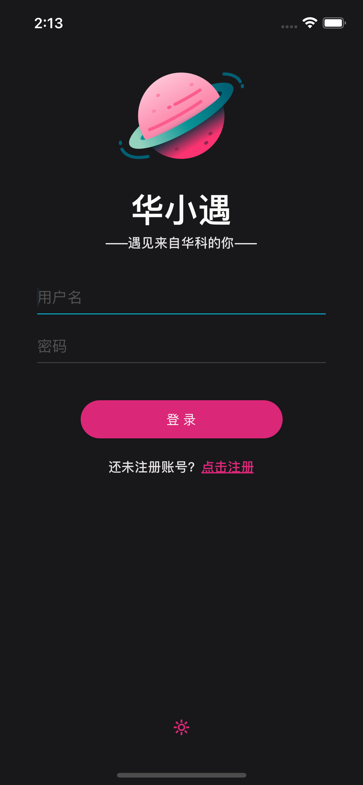
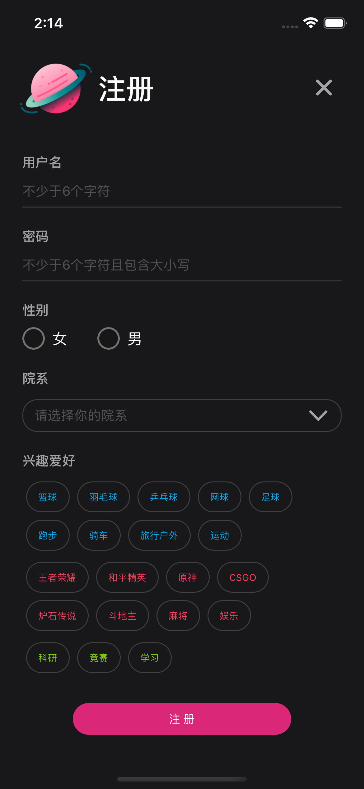
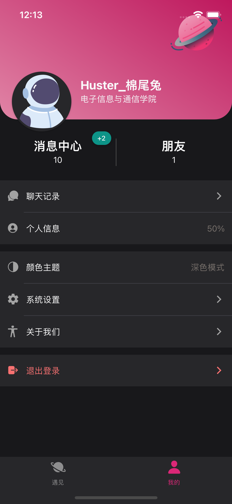
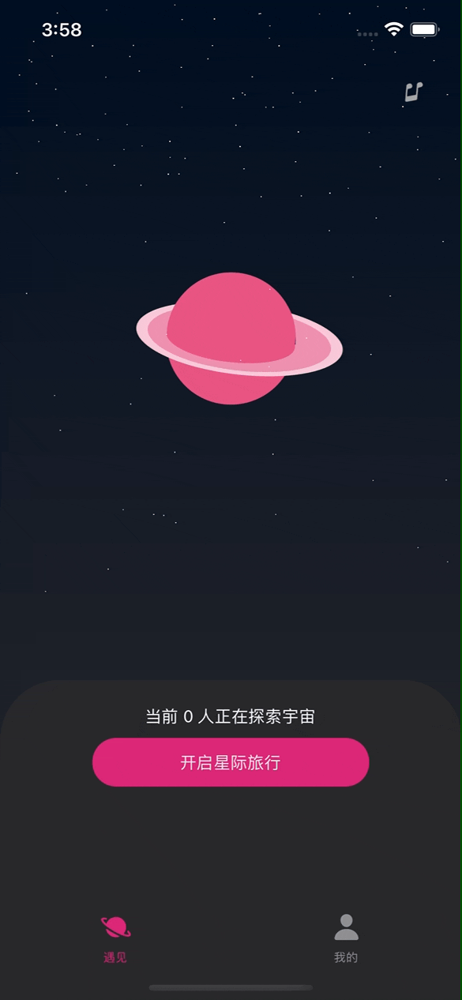
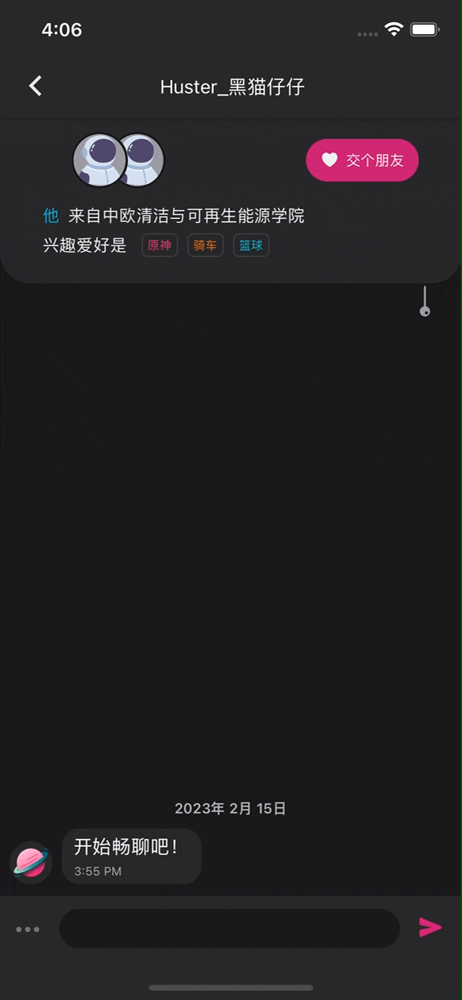
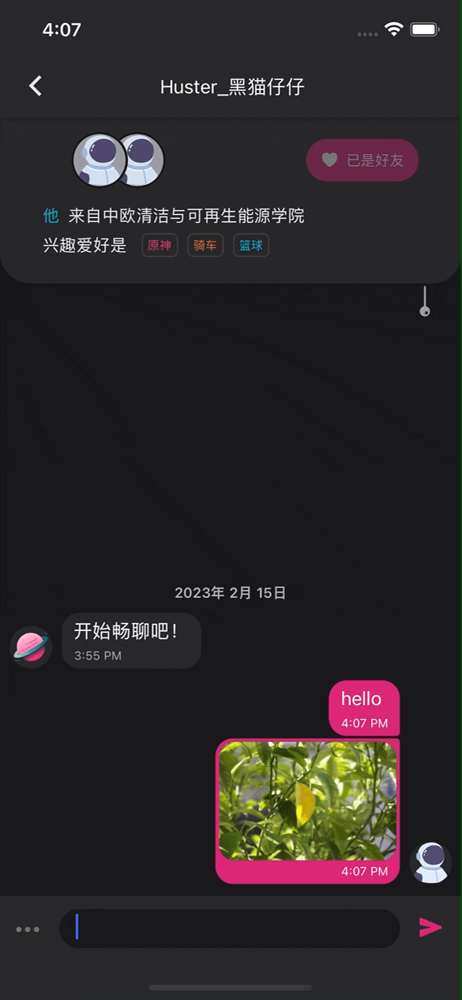
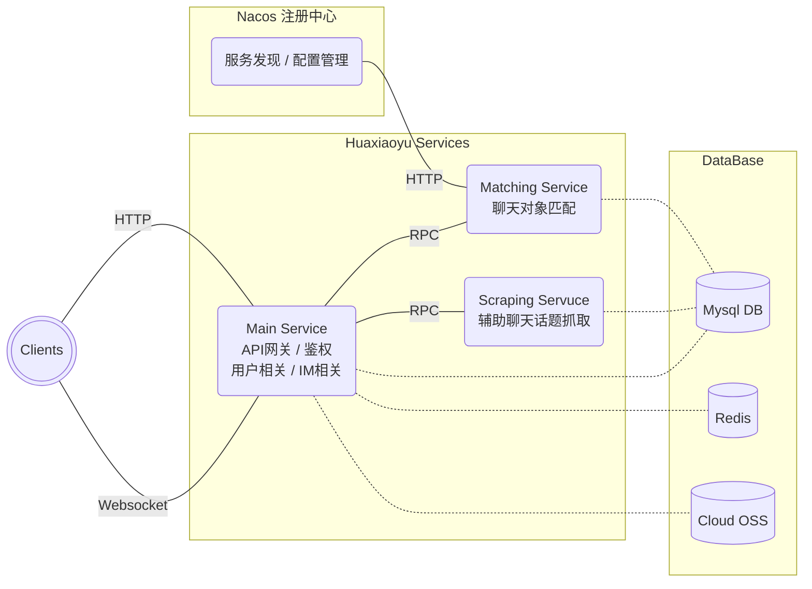
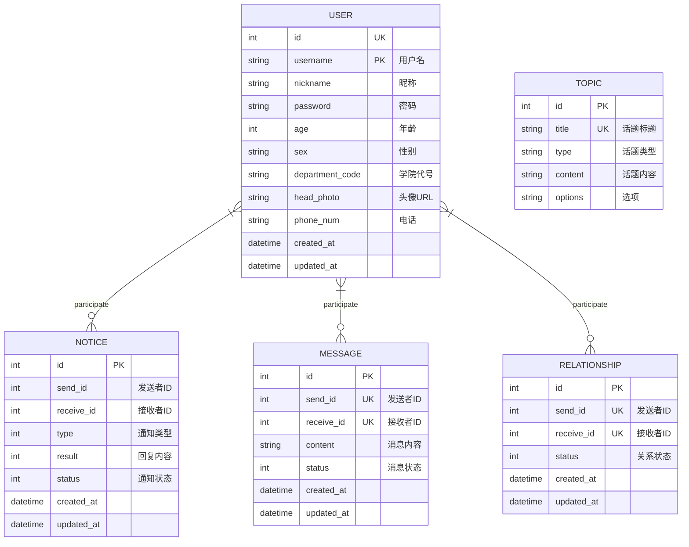

### 

# 
华小遇

一款主打华科校内交友的 APP！

- 同是 Huster，交友对象更靠谱；
- 通过算法匹配对象，保证志趣相投；
- 提供辅助聊天功能，助你轻松破冰，避免尴尬。

## 界面演示

#### 1. 登录 / 注册 / 我的

#### 2. 匹配 / 聊天 / 推荐话题

## 架构图

## ER 图

## 主要依赖

- [**Spring Cloud Alibaba**](https://github.com/alibaba/spring-cloud-alibaba)
- [**Nacos**](https://github.com/alibaba/Nacos)
- [**OpenFeign**](https://github.com/OpenFeign/feign)
- [**Spring Websocket**](https://spring.io/guides/gs/messaging-stomp-websocket)
- [**Spring Security**](https://github.com/spring-projects/spring-security)
- [**MyBatis-Plus**](https://github.com/baomidou/mybatis-plus)
- [**Alibaba Cloud OSS**](https://www.alibabacloud.com/zh/product/object-storage-service)

## 接口文档

[**API 文档**](https://apifox.com/apidoc/shared-73747cdd-880f-4b68-951f-7294685be27e)

## 服务端部署

- 修改根目录下 compose.yaml
- 应用容器化

  - 方法一：在服务器端拉取代码，执行`make build_images`，打包镜像
  - 方法二：本地执行`make build_push_multi`，打包多平台镜像并推至 hub

- 服务端执行`docker compose up -d`
